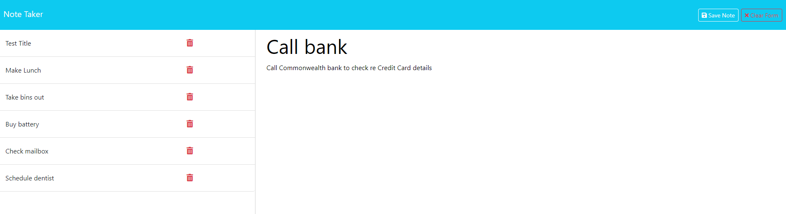

# A Note Taker using Express JS

## Description

This Note Taker application allows you to write and save notes. It uses an Express.js back end and will save, retrieve and delete note data from a JSON file. 

## Installation

The user will need to install the express package in order to use this application.  

## Usage

To use the Note Taker application, you can copy and this link into your browser:

The page should open as per below screenshots:

Once you're on the home page, simply click on "Get Started". You will be taken to the page where you can write and save your notes. 

On the notes page, simply type in the "note title" and the "note text" before clicking on the "save note" button. You will see that your written note will be saved on the left-hand column of the screen. 

If you wish to view one of the previous notes you have saved, click on the note title and the note details will appear on the right side of the screen. You will then be able to amend and re-save if you wish. 

If you wish to delete a note, click on the bin button next to that note. The note will disappear from the left side-tab and will no longer be available. 

## Credits

Coding Bootcamp by USYD x EDX

## License

Please refer to the LICENSE in the repo.

## Contacts

* GitHub: https://github.com/miloyang
* Email: miloyang9@gmail.com
